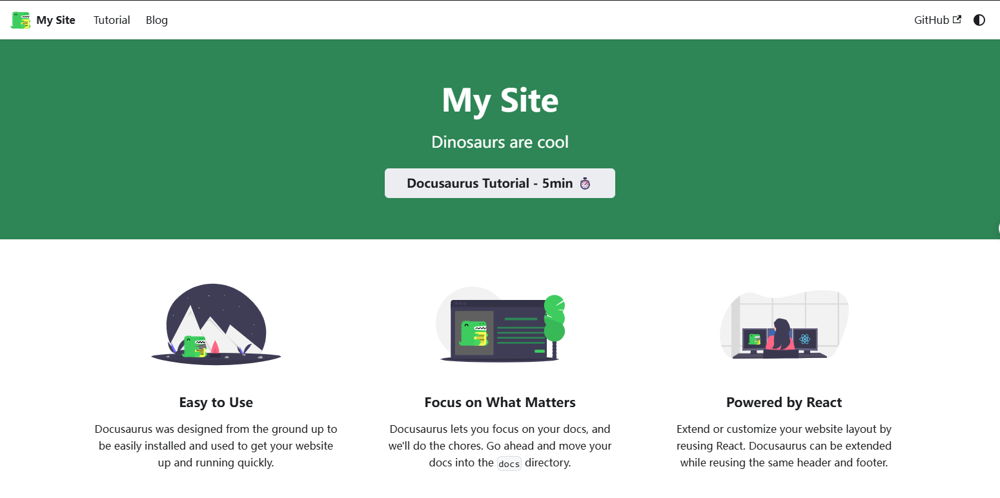
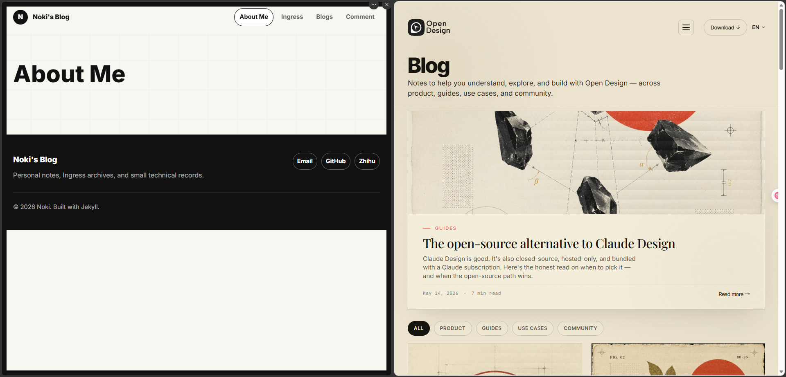
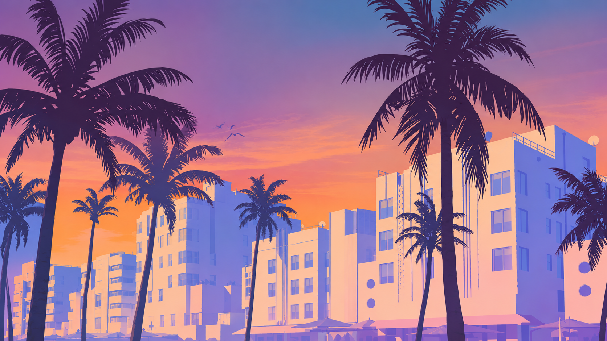

## 写在前面

开始想玩github page是因为之前在[Resistance Beijing](https://bjres.net/)也发了不少Ingress相关的文章，就想要不把这些文章集中到一个地方来，顺便也可以用来写一些其他的东西。

在这之前，我尝试了Hexo的方案，但是可能是因为内地对github的访问问题，我在使用的过程中遇到了不少的问题，想安装一个合适的主题都做不到，所以后面就放弃了这个方案。

后来我是参考了[极简风学术网站完全指南 Jekyll+Github Page｜2023](https://zhuanlan.zhihu.com/p/625724728)，非常感谢[Hanlin Cai](https://github.com/GuangLun2000)的分享，我直接fork了他的repo来搭建和收录我原来的文章。

## 架构方案

最近因为沉迷上了Codex，感觉原有的ui已经不能满足我了，所以就干脆想自己重新来做一套新的ui。

为了博客写作方便，还是希望和以前一样用markdown来写文章。想要使用的服务还是github page，毕竟可以白嫖，而且还能用上github.io这个我还挺喜欢的二级域名。

但是这个方案原生的jekyll是个比较大的问题。ruby-jekyll这个原生框架在windows上根本运行不起来，重新制作ui的话，每次都把ui文件推送到github上，再由github page来帮我编译调试起来也太麻烦了。所以我只能使用其他的方案来重新做。

参考了gpt给的几个方案，我最后选择了使用Docusaurus框架来搭建这个网站。一方面Docusaurus内置了博客系统，本来就是为了写文档而设计的框架，另一方面Docusaurus是基于react的，需要也可以使用react的扩展组件来实现一些功能。另外评论系统，则有基于disscusion的gissus来解决。

总结一下，这个网站的搭建方案：

- 前端框架：Docusaurus
- 评论系统：Gissus
- 文章编写：Markdown
- 文章托管：Github Page
- 文章编译：Github Action
- CDN加速: Cloudflare
- 域名：
  reiinoki.github.io   github page 自带免费域名
  reiinoki.dpdns.org   DigitalPlat Domains 免费域名，用于Cloudflare加速

使用的全是免费服务，虽然有些配置需要手动调整，毕竟代码部分都是Codex生成，总体做下来并不算困难。

Docusaurus的话，用node.js安装使用就可以了。以现在的agent的普及度来说，安装也只是一句话的小事情。

## 焕然一新

但是 Docusaurus 的默认主题嘛，确实是很文档风格了，作为个人博客来说个性还是很不足的。



当然，Docusaurus的showcase里也有一些不错的主题，不过我找来找去也没有感觉特别喜欢的，毕竟我还是想要一个属于自己的风格。

那既然都用Codex来生成代码了，那就干脆让Codex帮我做一套新的ui好了。一开始我看上的其实是OpenDesign的风格，但是Codex怎么做也做不出原站的感觉，有可能是因为Docusaurus的框架局限性？



啊？回答我？这真的是同样的主题？

折腾了几次后，刚好最近GTA6预售出来了，又翻到去年这张宣传图，风格我还挺喜欢的就决定让Codex帮我做一套配色方案。


以下为Codex推荐的主题方案，分享给看到这里的大家吧。

```
颜色建议：

Light:
背景        #fff8f2
正文背景    #ffffff
主文字      #241f2f
次级文字    #6d6475
边框        #eaded8
主色        #e85d75  coral pink
强调色      #f29d4b  sunset orange
链接色      #177e89  teal

Dark:
背景        #17131f
正文背景    #211b2a
主文字      #f5edf3
次级文字    #c6b9c5
边框        #3a3046
主色        #ff7a90
强调色      #ffb35c
链接色      #5fd3d0

字体建议：

正文:
"Inter", "Noto Sans SC", "Noto Sans JP", system-ui, sans-serif

文章正文:
"Source Serif 4", "Noto Serif SC", "Noto Serif JP", serif
```

因为这个宣传图的元素的还是太多了，我需要的更多是这个配色和氛围感，就让gpt把这个宣传图的人物和文字都去掉了，只保留了背景。虽然生成的效果亮比原图亮了一些，不过用来做背景图已经够用了。



然后还顺便做了这个...


确实有点意思，AI还是太好用了。

然后根据这个背景图的配色，Codex帮我生成了一个新的主题配色方案，修改后就是您现在看到的这个样子了。

头衔这个输入删除的动画，则是参考了一些博客的设计加入进来的。因为Docusaurus是React框架，所以实现也是用React的方案来实现的。

总的来说，我还是很满意这个实现效果的。

## 开张大吉

到这个版本总算是可以开张的程度了，今后我应该也用这个博客作为自己写文章的主要站点，有机会也会尝试各种新的功能。

唯一感觉可惜的是，github page毕竟只是静态页面，应该这样开发下来也差不多到极限了吧。

希望也可以借助这个站点来认识更多的朋友，谢谢你们的访问，欢迎评论留言！
