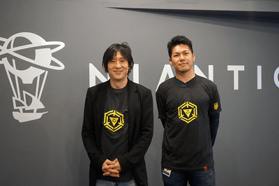
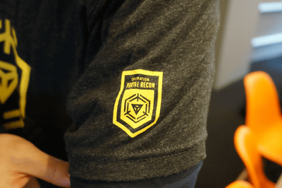

---
title: "日本才是爹！Portal Recon将逐步向日本全国所有15、16级玩家开放！"
date: "2017-04-12"
slug: "/2017-04-12"
---

[原文链接](http://k-tai.watch.impress.co.jp/docs/interview/1054338.html)

4月11日日本网站ケータイ Watch对日本猩猩川岛和须贺进行了采访。

因为全文比较长就不逐字翻译了…就翻译个大意好了。

### 1. 全球碎片战

川岛猩猩对绿军大获全胜的结果表示非常的意外，接下来的故事线，NPC们的命运将会又绿军来决定了。（嗯…这是说你们玩成这样我们编剧都编不下去了的意思吗）

这次的碎片战总共对碎片进行了64万公里的移动，相当于绕地球16圈的距离。其中绿军37万，蓝军27万。

虽然很多玩家都说碎片走了就别再来了啊，可是这么说说又跑到别的战场继续参战的玩家也是有的，碎片站真是有着独特的魅力啊。（）

### 2. 关于五六月的新活动

基本上跟没说一样。

Magnus Awakens跟以往的XMA和MD等等不一样，是一项露营的活动，而日本也会展开不是露营但类似的活动。（温泉旅馆活动？）

### 3. 今年大家最期待的Anomaly呢

还没有确定。（后面的内容都可以不用看了，大家洗洗睡吧。）

### 4. Portal Recon

dalao代工系统 Portal Recon 会在12日（今天！）逐步向达到15级和16级的玩家开放（只限日本）。

（猩猩这坑爹的工作效率还有日本爹真是好啊）

Portal Recon也会对其他NIA的产品，PMGO（天国的PMGO）等（目前不是只有这两个吗！还有没什么卵用的Field Trip）产生影响（就是说PMGO上也能上线就是了）

工作成绩突出的假猩猩还能得到特典T-shirt，限量20件…（猩猩你这也太抠了吧）

特典T-shit如图

袖子的PR图案

### 5. 万众期待的 ingress 2.0

连测试版都没出来的样子…不过说应该会在今年内发布。

因为2.0用了和PMGO一样的unity的环境开发所以会有3D空间的玩法，也可能会有其他的设备用于ingress的游戏中。（基本上等于没说…）

后面大半都是PMGO的闲聊了...

也有讲到可穿戴设备不过除了小畜生快跑plus也没有什么实用的设备所以就暂时没计划

所以中国区就不开服了吗TAT

日本粑粑真是好啊…今年怎么不开一场全日本的XMA！差评！

本人水平有限如果有弄错的地方请在评论区指出（捂脸）
