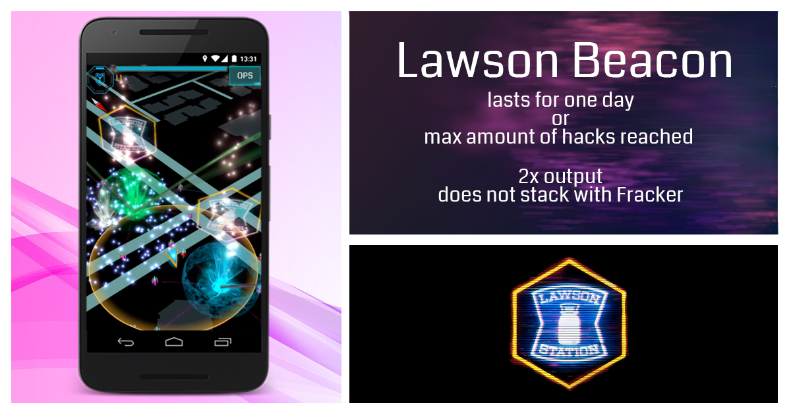
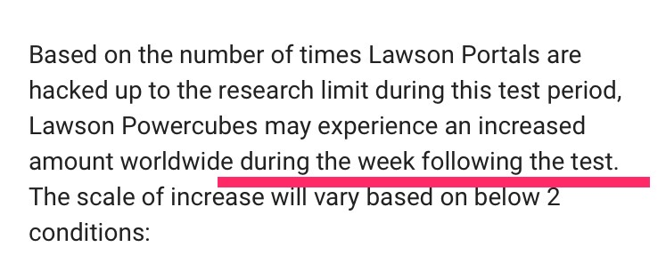
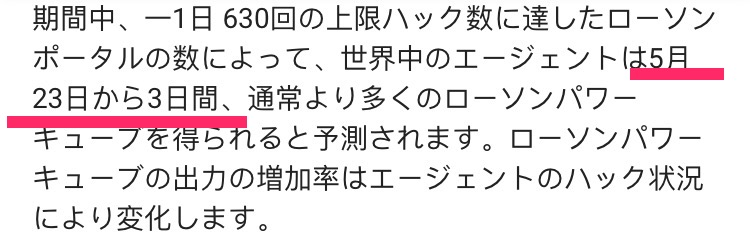
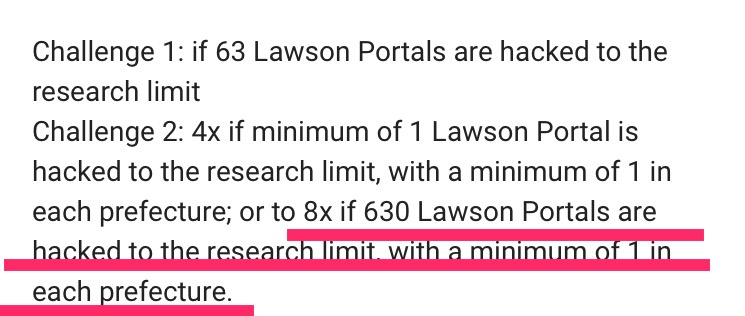
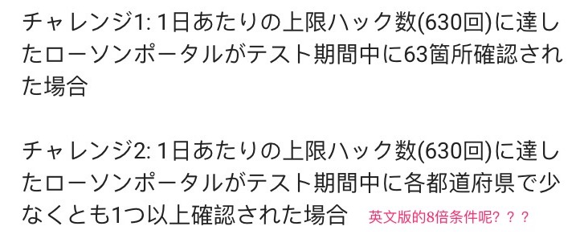
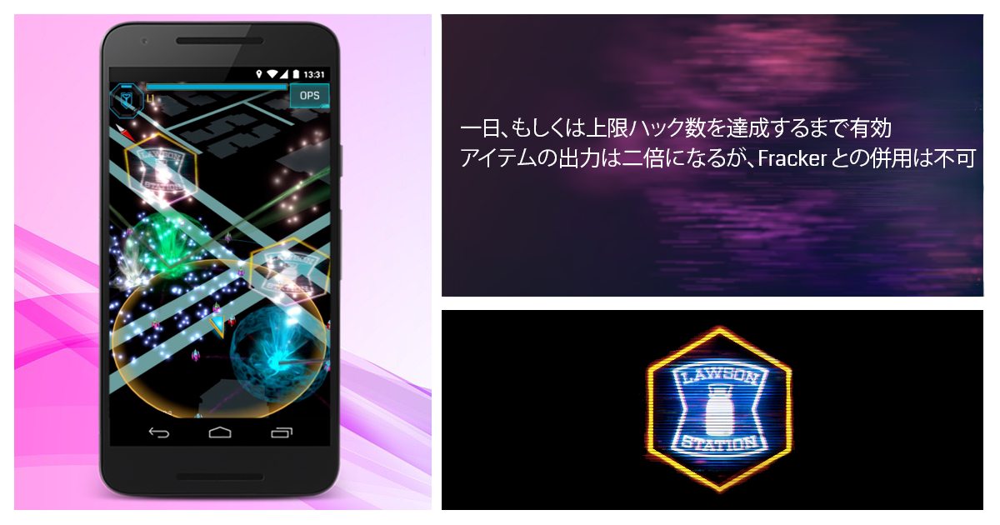

---
title: "日本爹专属！罗森灭灯活动！"
date: "2017-05-16"
slug: "/2017-05-16"
---

猩猩今天0.30突然在g+上发布了日本爹的专属新活动

之前解密的罗森灯终于上架了！

不过**不是上架到猩猩商城**上而是日本全国的罗森官方po上！

这个灯可不是一般的灯，它还具有增强版的薯条功能！一天可以630次出双倍物资！

（之所以是630嘛…因为罗森日语发音ro-son与63谐音就这么糊弄过去了）

而当达到了一天的上限，这个灯就会灭掉，罗森的po也会恢复原来的样子。

在16号到22号的一周内，日本全国的罗森po都会亮起这个特别的灯出来，而全国玩家的目标就是尽可能多地灭掉这些灯。

完成以下的挑战后，在23号开始三天（一周？）内，全世界玩家摸出**罗森糖**的几率会增加！

（然而罗森糖早就烂大街了我还嫌占仓位）

挑战1：有**63**个罗森po达到了上限被灭灯

挑战2：日本的所有都道府县都**至少有一个**罗森po被灭灯（这个太简单了吧）

两个挑战其中一个完成就可以增加双倍爆率！两个就是四倍！

（哇！仓位又要被罗森糖挤爆了…）

活动结束后，23号开始三天（一周？）内全国的罗森po将会点上灭灯多的阵营灯。

（分割线）

以下本人吐槽：

猩猩这活动发布得太不用心了，日文版和英文版的g+内容并不完全一致…

罗森糖爆率增加时间

所以这是3天还是一周？还是说猩猩的一周其实就是3天？

还有后面的挑战2

英文版有的，达成630灭灯并且都道府县每个至少一个被灭灯的8倍爆率消失了…

（还有英文版我自己看了好几次都看不太懂什么意思…这个4X8X什么意思不好意思我英语太差了，后来是@Magicacid 解释了下还有后来看的日文版才明白过来）

另外英文版给人的感觉是挑战1达成双倍后完成挑战2才有4倍的样子…

再说配图

英文版第一眼的感觉就是出了个能持续亮一天或者刷630次双倍物资的灯…

（当然也有可能是我英语太差了）

日语版倒是做得省事多了…

猩猩你们都抱上罗森有钱人的大腿了！临时工也不能请个用心点的吗！请我也行啊！
