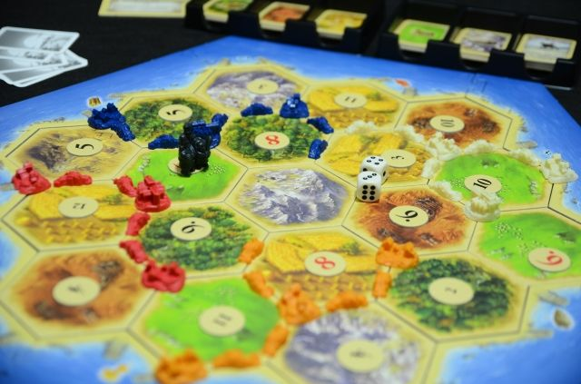

---
title: "猩猩你旧游戏一堆bug没修好还开新坑？一开还开十个？"
date: "2020-07-06"
slug: "/2020-07-06"
---

原文链接：[https://app.famitsu.com/20200616_1653730/](https://app.famitsu.com/20200616_1653730/)

（非全文翻译，毕竟揉揉又不会给我稿费）

近日，我们的猩猩王， Niantic Lab CEO John Hanke 接受了日本著名游戏媒体Fami通的采访。其中透露了最近猩猩公司的游戏开发状况，猩猩居然有10个以上的游戏在开发中？！

开发中的游戏

我们知道，猩猩现在发行的游戏除了本公众号主推的动物森友会（不是是ingress）以外，还有大红大紫然而在国内只有少数地区可以玩到的Pokemon Go 以及玩家相对少得多的 Harry Potter：Wizard Units。这开发中的10个以上游戏有一个已经在去年发布了相关的情报，名字是 Catan: World Explorers，由国外著名的桌面游戏Catan (卡坦岛)为基础改编。

桌游：卡坦岛

Niantic Lab新游戏 Catan: World Explorers 概念图

该游戏现在已接受预注册

预注册地址： [www.catanworldexplorers.com](http://www.catanworldexplorers.com)

从卡坦岛的玩法来看，这个新手游应该也和ingress有所类似也是争夺portal之类的玩法。希望这个新游戏不要和HPWU一样无趣就好了。（顺便希望国内早日能玩上pmgo）

此外，猩猩王还透露了今后每年会发布两款游戏的目标。

关于新活动的试验

2017年的芝加哥GO Fest因为网络问题成为完全的灾难（猩猩王还因此在台上被丢了水瓶），之后猩猩在日本横滨和横须贺办活动倒也还算顺利，就是人气宝可梦的社群日总会炸服（之前的铁哑铃日，宝贝龙日等都出现了至少半小时的连接问题，笔者参加的时候就出现过）。

今年因为新冠影响，猩猩为了让宝可梦训练师在家里也可以玩游戏，专门做了pmgo的极巨团体战远程参与票（氪金道具），还上线了pvp联盟排位比赛系统（不过因为后来有人利用了游戏bug打上第一名现在又停服整顿中）。顺便说去年宝可梦世锦赛pmgo就弄了个pvp的表演赛为pmgo pvp玩法做推广了。（本人因为脸黑抓不到100 iv基本不玩pvp）

不仅如此，今年的GO Fest 2020也做成了周末不限地区，即使你在家里也可以参加的活动（当然还是要氪金），猩猩还宣布将会捐出至少5亿美元的门票收入，宝可梦世界第一ip真的很赚钱（因为参加会赠送限定幻之宝可梦比克提尼）。

GO Fest 2020 和比克提尼剪影（这个真的不是皮卡丘！）

地方经济支援计划

在采访的最后，猩猩王还透露了pmgo的地方经济支援计划，由地区的宝可梦训练师（对的不是ingress agent, 纯HPWU玩家也没有人权）推荐1000所店铺，在一年内免费为其所在地生成赞助商样式的宝可补给站（PokeStop官方译名）或道馆。店的位置目前仅限定在日本、美国、墨西哥、加拿大和英国五个国家。
