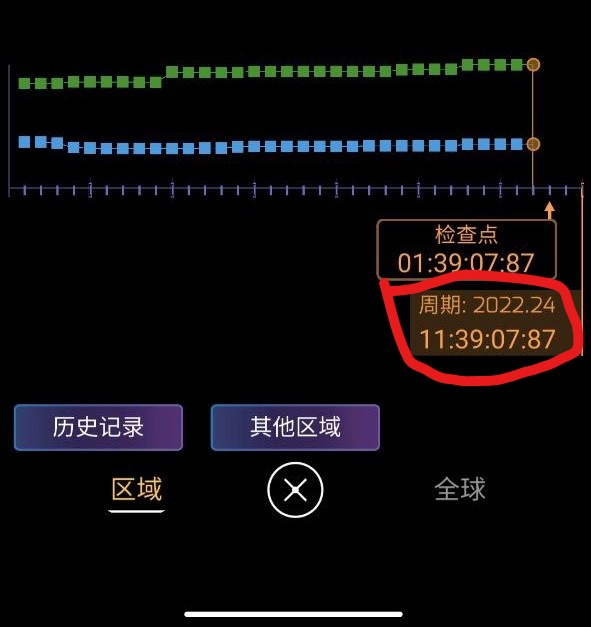
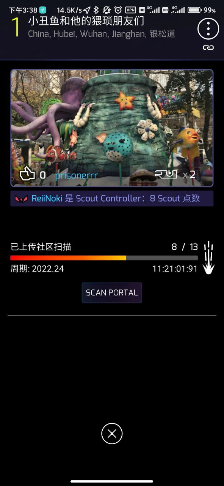
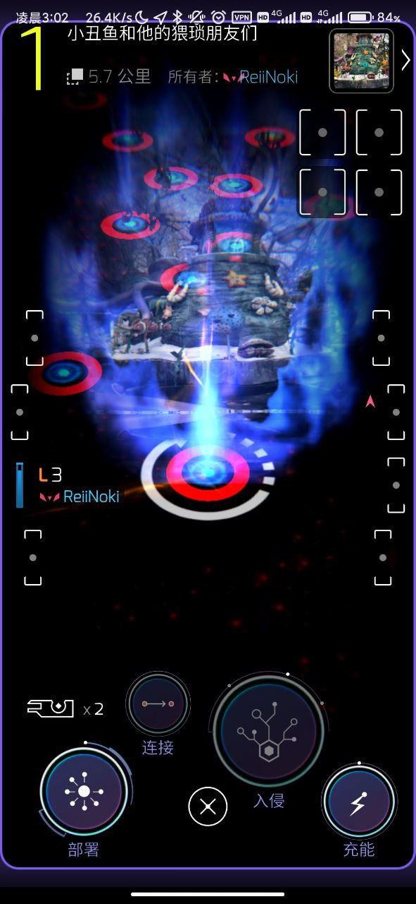
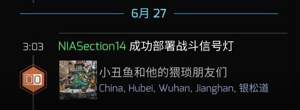
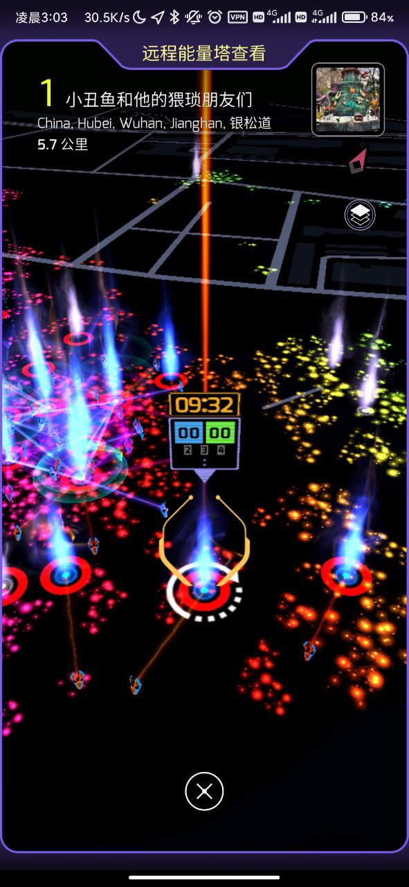

---
title: "白嫖猩猩战斗道标简要介绍"
date: "2022-06-27"
slug: "/2022-06-27"
---

这周末出门顺手做了7个portal scan测试怎么用portal scan的机制来让猩猩投放战斗道标，看看有没有机会白嫖猩猩的道标来开活动牌子。

之前看了下公众号也没什么详细的攻略，既然成功开出战斗道标了就顺便写一下方便后面有需求的大佬吧。

首先是要计算下一个结算周期的开始时间，从ingress的比分界面，或者po上的portal scan上可以看到。

接下来就是按下scan portal的按钮，在本周期内任意时间对po进行7次扫描上传，成功后po上会出现一个环形箭头。

然后就是等到这个周期结束结算，下个周期开始（每个周期是175小时），猩猩就会给这个po投放战斗道标了。不过这次结算时间真的太阴间了吧...

投放的战斗道标可能实际会误差个2到3分钟，今天的周期接算是3点，晚了3分钟。

现在离活动结束还有几个小时，远程充充电也可以拿牌子了。

最重要的前提还是周期结算时间刚好落在活动时间范围内，每个周期是175小时约7天半，在po页面或者得分页面查询本周期结算时间，在活动周当周计算，结算时间落在这个周末就可行。对10个战斗道标po操作就可以拿活动牌子了。
