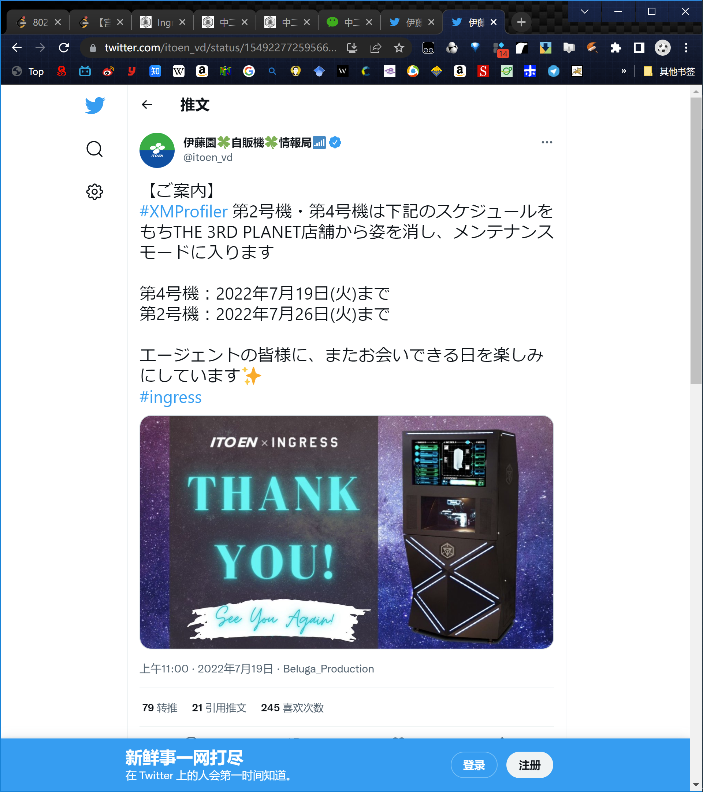
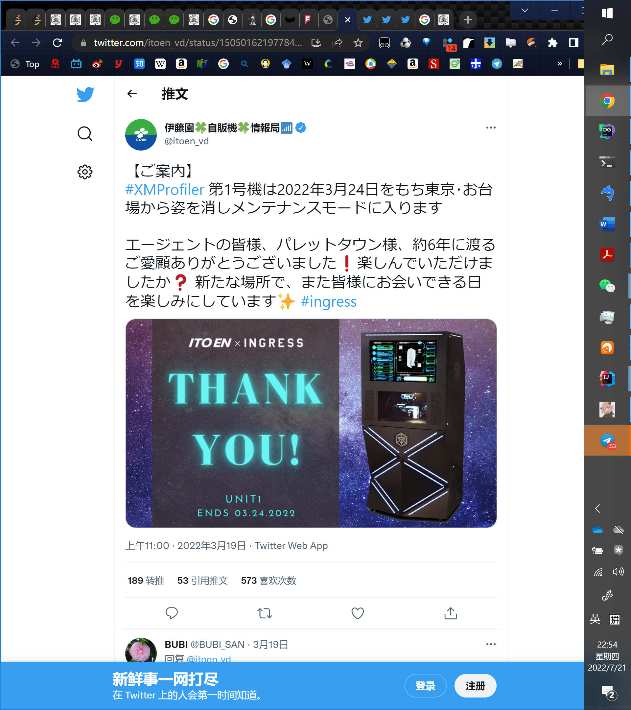

---
title: "中二机器即将下线！| XM-Profiler简要回顾"
date: "2022-07-21"
slug: "/2022-07-21"
---

7月19日，日本著名饮料厂商伊藤园官方推特 伊藤园自贩机情报局发布了以下的推特：

在日本京都放置的XM-Profiler中二机器4号机已进入维修状态（其实应该下线了）。

在仙台的2号机则将在7月26日进入维修状态（下线）。

简要回顾一下XM-Profiler中二机器（在北蓝公众号报道过）的历史吧。

2016年4月27日，ingress日本官方在东京台场科学未来馆举行了一次special meet up, 猩猩王John Hanke在现场公布了日本的特别企划，其中一个重大企划就是XM-Profiler中二机器的上线。

https://mp.weixin.qq.com/s?\_\_biz=MzA3NTc3Njk5Nw==&mid=2651691662&idx=2&sn=721b4fb994bd581a7ea877fe60027de8&scene=21#wechat_redirect

XM-Profiler中二机器作为ingress官方实体po首次上线是2016年5月14日，在东京台场Venus Fort举办了隆重的上线仪式。

[https://mp.weixin.qq.com/s?__biz=MzA3NTc3Njk5Nw==&mid=2651692131&idx=1&sn=68479dd14a7aab71bef2ec1841f2031d#rd](https://mp.weixin.qq.com/s?__biz=MzA3NTc3Njk5Nw==&mid=2651692131&idx=1&sn=68479dd14a7aab71bef2ec1841f2031d#rd)

XM-Profiler上线后本人去现场做了实地考察。

https://mp.weixin.qq.com/s?\_\_biz=MzA3NTc3Njk5Nw==&mid=2651693330&idx=1&sn=f60d1e8ddf59f8241be1b4f890531660&scene=21#wechat_redirect

同年9月10日，二号机在日本仙台上线

[https://bjres.net/2016/09/15/%e4%b8%ad%e4%ba%8c%e6%9c%ba%e5%99%a8%e5%86%8d%e4%b8%b4-xm-profiler-%e4%ba%8c%e5%8f%b7%e6%9c%ba/](https://bjres.net/2016/09/15/%e4%b8%ad%e4%ba%8c%e6%9c%ba%e5%99%a8%e5%86%8d%e4%b8%b4-xm-profiler-%e4%ba%8c%e5%8f%b7%e6%9c%ba/)

10月份，日本大阪悄悄上线了三号机，上线后日本绿军创建了史上最大行动，将三台中二机器连了起来。

[https://bjres.net/2016/10/31/%E6%88%91%E6%9C%89%E4%B8%80%E4%B8%AA-xm-profiler%EF%BC%8C%E6%88%91%E8%BF%98%E6%9C%89%E4%B8%80%E4%B8%AA-xm-profiler%EF%BC%8C%E5%86%8D%E6%9D%A5%E4%B8%80%E4%B8%AA%E5%B0%B1/](https://bjres.net/2016/10/31/%E6%88%91%E6%9C%89%E4%B8%80%E4%B8%AA-xm-profiler%EF%BC%8C%E6%88%91%E8%BF%98%E6%9C%89%E4%B8%80%E4%B8%AA-xm-profiler%EF%BC%8C%E5%86%8D%E6%9D%A5%E4%B8%80%E4%B8%AA%E5%B0%B1/)

日本京都的四号机在12月14日上线（相关报道已经找不到了）

2022年3月19日，伊藤园官方发布了一号机下线的通知。

之后这个po的位置已经被移动到南极，可以通过以下的链接查看。

[https://intel.ingress.com/intel?pll=-82.63037,129.258409](https://intel.ingress.com/intel?pll=-82.63037,129.258409)

京都四号机虽然实体已下线，不过目前在intel上仍可见。

[https://intel.ingress.com/intel?pll=35.010371,135.741407](https://intel.ingress.com/intel?pll=35.010371,135.741407)

最后，附上二号机和三号机的链接：

仙台二号机（不理解为什么不叫XM Profiler SENDAI，破坏队形了！）：

[https://intel.ingress.com/intel?pll=38.260959,140.883541](https://intel.ingress.com/intel?pll=38.260959,140.883541)

大阪三号机：

[https://intel.ingress.com/intel?pll=34.705434,135.490526](https://intel.ingress.com/intel?pll=34.705434,135.490526)

所以要是一开始就有卖饮料的功能伊藤园不就还会养着嘛，当然也可能被伊藤园拿去改造成可以卖饮料的自动贩卖机了！
