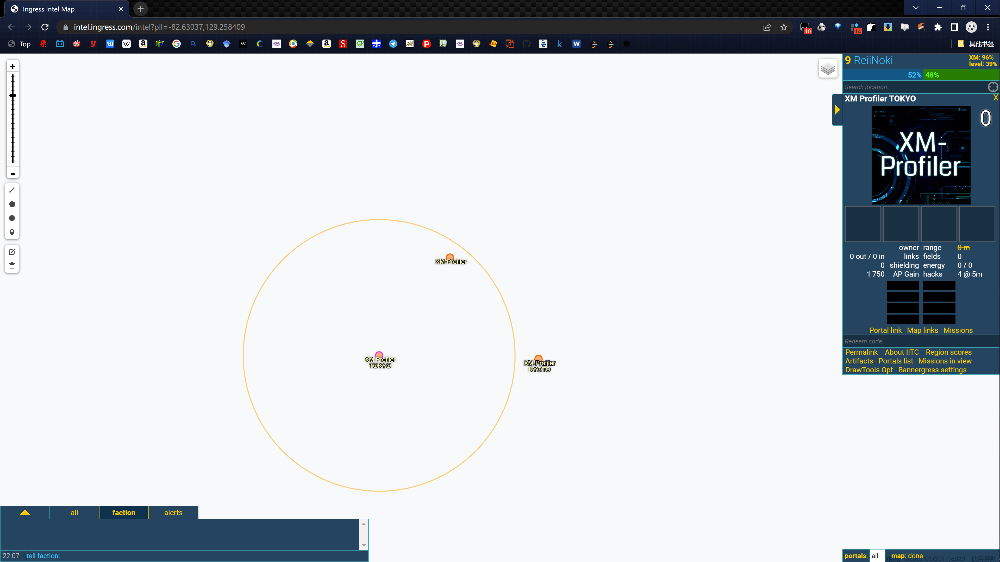
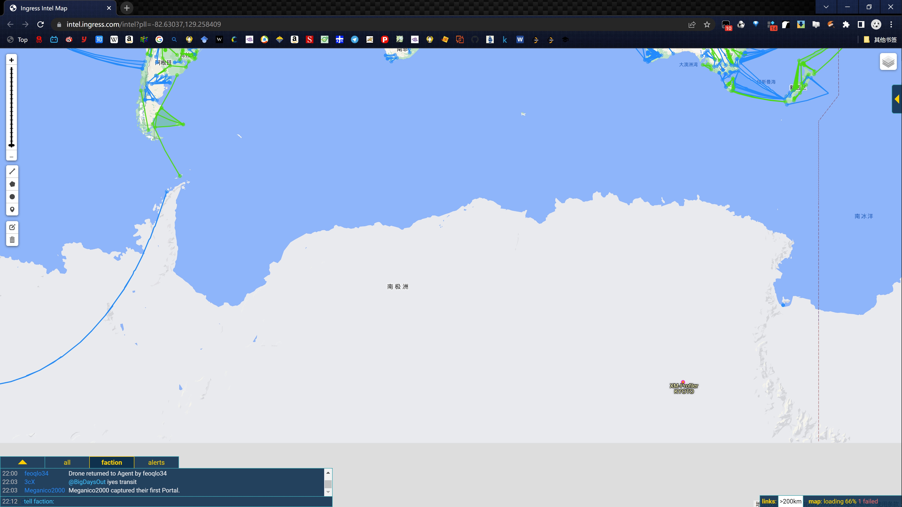
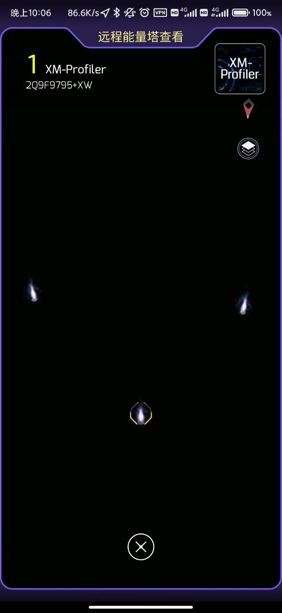

---
title: "中二机器被移动到南极"
date: "2022-08-04"
slug: "/2022-08-04"
---

上月我们报道了位于日本仙台的中二机器XM-Profiler 2号机和位于日本京都的4号机在7月内下线的新闻：

（这里是中二机器即将下线的链接）

实体下线的2号机和4号机po位置现在已和东京1号机一样被移动到南极了。

现在可以在intel上看到他们三兄弟在一起了。

通过以下链接在游戏里也可看到

https://intel.ingress.com/intel?pll=-82.63037,129.258409

剩下的位于大阪2号机今年内可能也会下线并移动到南极了吧。
