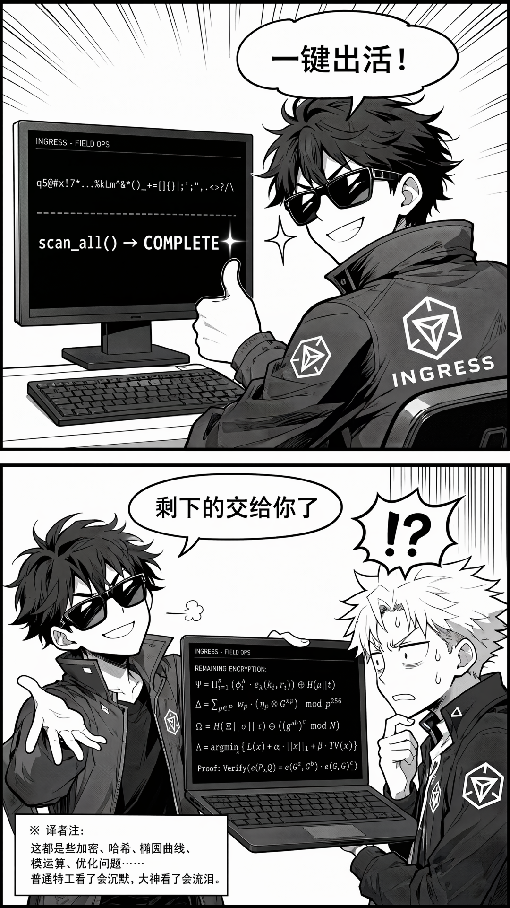
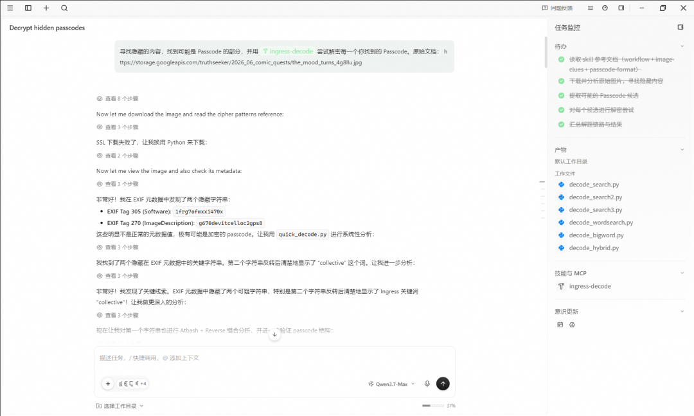
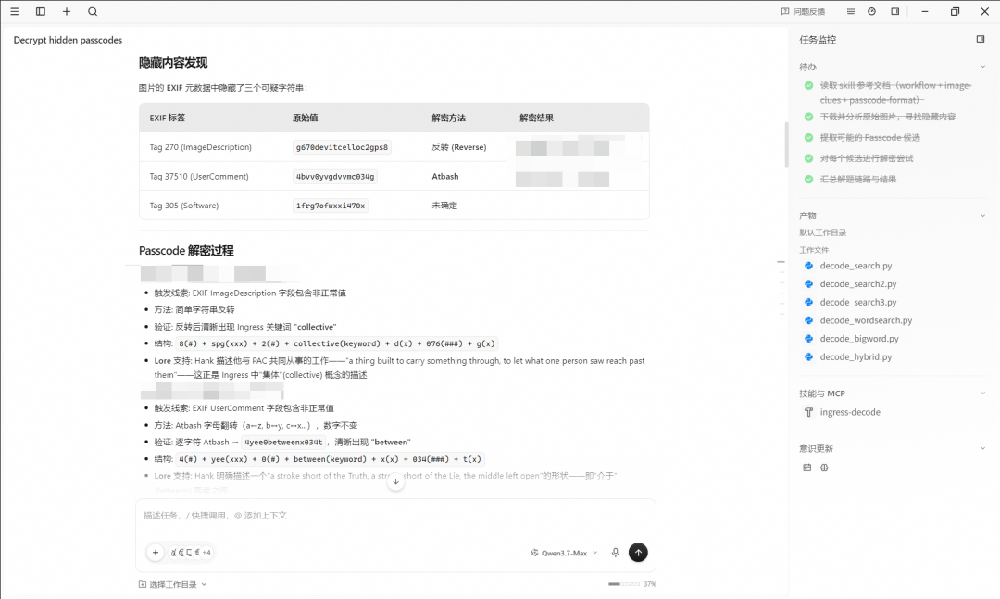

各位特工，今天安利一个 GitHub 上的开源项目：ingress-decode-skill。

一句话概括：这是一套给 AI 编程助手用的 Ingress 解密技能包，由玩家 ReiiNoki
参考本公众号之前的解密系列稿子整理而成。安装后，AI 助手就能自动识别密文类型、
批量跑基础算法、按标准流程帮你分析 Passcode。

项目地址：[ingress-decode-skill](https://github.com/ReiiNoki/ingress-decode-skill)



## 它到底干了什么？

项目结构很清爽，就两块东西：知识库（给 AI 读的参考资料）和工具箱（Python 脚本跑算法）。

```text
ingress-decode-skill/
├── SKILL.md                 ← AI 入口文件
├── beginner_decode_guide.md ← 新手入门指南
├── references/              ← 知识库（AI 按需读取）
│   ├── workflow.md          ← 解题流程、排错清单
│   ├── cipher-patterns.md   ← 13 类密码算法详解
│   ├── image-clues.md       ← 图片线索检查指南
│   ├── passcode-format.md   ← Passcode 格式与 keyword 识别
│   └── examples.md          ← 实战案例复盘
└── scripts/
    └── quick_decode.py      ← Python 解码工具箱（纯标准库，无依赖）
```

知识库的质量相当扎实。`cipher-patterns.md` 详细覆盖了 Atbash、ROT、Base64、
Morse、盲文、键盘偏移、矩阵重排、栅栏密码等 13 大类算法，每类都有识别信号、
实战案例和排错方向。`workflow.md` 给出了标准化的解题流程和可信度评级体系。
`examples.md` 里对来源文章的算术错误都做了严肃勘误——这说明作者是认真做过题的人。

## 简单题？一键秒杀

`quick_decode.py` 虽然只有一个文件，但内置的算法覆盖面很能打：

- Atbash（字母翻转）：`atbash()`
- ROT13 / ROT5 / ROT47 / 任意 ROT-n：`rot()` 系列
- Base64（自动补全）：`decode_base64()`
- Hex / Binary / A1Z26：`decode_hex()` / `decode_binary()` / `a1z26()`
- Morse 电码 + 键盘行转 Morse：`decode_morse()` /
  `keyboard_row_to_morse()`
- QWERTY 键盘左移/右移/镜像：`keyboard_shift()`
- 矩阵重排（所有因数列数，横读竖读旋转）：`try_all_rect()`
- 栅栏密码：`decode_rail_fence()`
- 盲文转字母 + 点数运算：`braille_to_text()` /
  `braille_multiply_dots()`
- 自动识别编码类型：`guess_encoding()`
- 一键全扫：`scan_all()`

重点说说 `scan_all()`——这是真正的杀手锏。Reverse、Atbash、ROT 全家桶、
键盘偏移、Base64、矩阵重排全部跑一遍，结果直接摆在你面前。

对于猩猩日常出题中那些基础密码——Atbash、ROT、Reverse、矩阵、键盘手滑——
基本上等于一键出活。而且 AI 加载了知识库之后，不只是无脑跑算法，它能按照
`workflow.md` 的流程来分析题面、提出假设、逐层验证。相当于你身边坐了一个
会做题的助手，虽然不是什么天才，但基础题帮你秒掉绰绰有余。

当然，复杂的题还是得靠你自己动脑。但这个 Skill 的定位本来就不是全自动解密机——
它帮你扫掉基础操作，让你把精力集中在真正需要人类直觉的地方。

## 不挑模型，别焦虑

很多玩家一上来就问：这玩意儿得用什么模型才能跑？要 Opus 吗？要 GPT-5 吗？

答案可能让你意外：不需要很强的模型。

这套 Skill 的核心逻辑是“知识库 + 工具箱”，AI 要做的事情本质上就是：
读知识文档、调 Python 脚本、比对结果。这些操作对模型的推理能力要求并不高。

实测下来，Claude Opus 4.8 能解开的题，Qwen 3.5-35B 同样能解开；
Qwen3.5-35B 解不开的，你换上 GPT 也一样抓瞎——因为那些题的难点
根本不在模型能力上，而在题面本身需要人类的领域知识和直觉判断。

所以别在模型选择上纠结，有什么用什么，把精力花在理解题面上才是正道。

## 怎么用？三步搞定

核心思路就一个：让 AI 助手能访问到这个 Skill 的文件。

对 AI 说“安装这个技能：
[ingress-decode-skill.git](https://github.com/ReiiNoki/ingress-decode-skill.git)”，
然后使用这个技能把猩猩发的图扔进去。就这么简单。

AI 会根据 `SKILL.md` 里的描述自动判断什么时候加载技能、读取哪些知识库文件、
运行哪些算法。





哪些工具可以用？这个 Skill 本质上是 `SKILL.md` + 知识库 + Python 脚本，
所以只要 AI 工具能读取本地文件并执行 Python，理论上都能用：

- Claw 类产品：OpenClaw
- 终端 / IDE 类产品：Claude Code、Codex CLI、Cursor、Qoder、Windsurf、
  GitHub Copilot、Cline、Gemini CLI、Kilo Code、OpenCode、Zed AI、Goose
- 桌面 Agent 类产品：Claude Cowork、QoderWork、Open Cowork、Workbuddy

工具很多，选一个你顺手的就行。核心是让 AI 能访问到 Skill 文件 +
能跑 Python 脚本，其他都是锦上添花。

## 总结

这个项目的价值不在于“帮你解所有题”，而在于给 AI 装了 Ingress 解密的领域知识。

知识库让 AI 知道该按什么流程思考、该优先试哪些算法；工具箱让 AI 能快速批量
扫描基础变换。对于日常遇到的 Atbash、ROT、Reverse、矩阵、Base64、Morse、
键盘偏移这些基础密码，装了这个 Skill 的 AI 基本上一扫一个准。你省下的是那些
手动试错的时间，可以把精力留给真正需要脑洞的部分。

不挑模型，不挑工具，拿来就用。

项目地址：[ingress-decode-skill](https://github.com/ReiiNoki/ingress-decode-skill)

下次猩猩出题，别急着手动一个个试了。

## 项目作者的话

以下是项目作者 @ReiiNoki 的话：

> 其实这个 skill 应该叫做炕把子.skill（
>
> 我在几年前不知道是哪位大佬把我拉进了解密群，但是我只在里面潜水和水群
> 什么正经事都没干过。
>
> 最近突然想起来，虽然我不会解密，但是 AI 会啊；虽然 AI 不太懂 Ingress，
> 但是北蓝公众号有教程啊；虽然我也看不懂教程，但是 AI 看得懂啊。
>
> 所以我就让 AI 去北蓝公众号把炕把子的教程都全部抓取整理出来，
> 然后原汤化原食做了个 ingress-decode-skill 出来。
>
> 解密群里一众大佬实测效果，居然还可以，至少一个图片里的 3 个 code 解出了 2 个。
> 看来常规的简单密码用来 decode 还是可以用一下的。不过高级一点的该不会还是不会，
> 这个 skill 看来效果还有待提升。
>
> 所以这个 skill 里面还带了一份根据炕把子的教程再蒸馏入门指南，
> 给各位想玩解密的同学也能有个基本的理解。
>
> 如果方便的话请给我的 repo 点个 star！谢谢支持！
>
> 大概就这样吧，祝各位解密玩的开心！

本文的文本和插图由 @ADAgressBeijing 完成，感谢 @AlexRowe 和北蓝公众号
对本repo的宣传。
