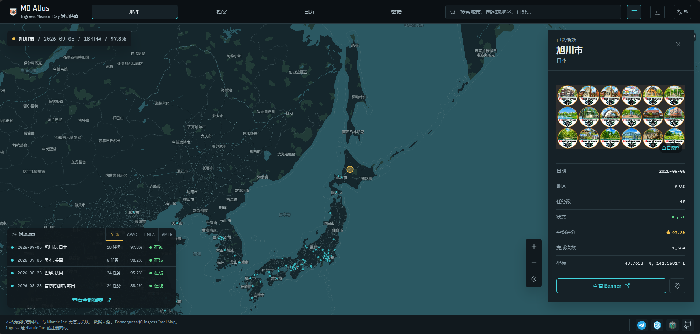
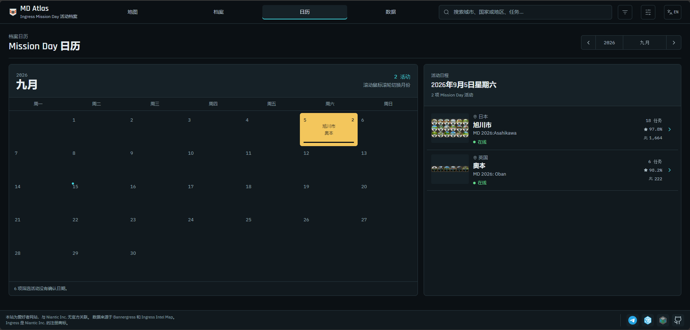
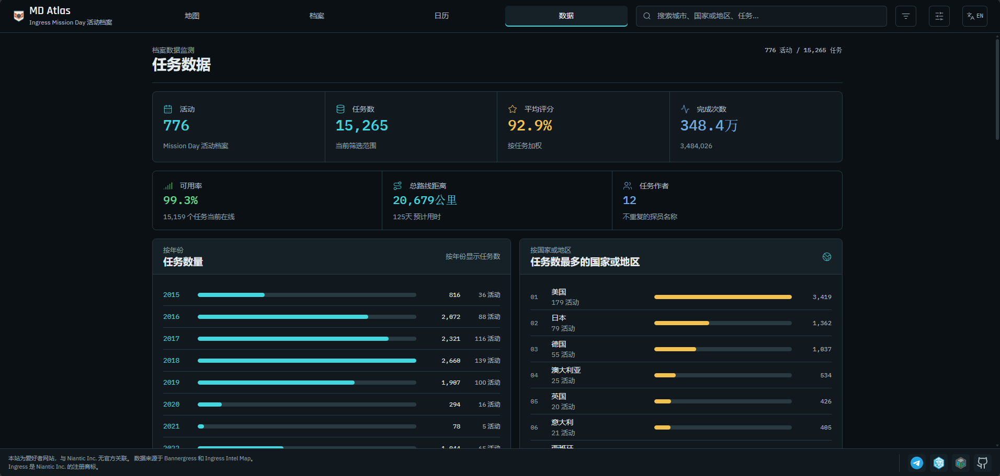

Ingress Mission Day 一直以来是我个人最喜欢的 Ingress 官方活动。今年中国大陆地区佛山 MD 的活动顺利举行，也让近来关于 MD 申请的讨论热烈了起来。当时我突然想到，好像没有一个把 MD 活动历史记录下来、并统计历史数据的网站。找了一下，全网确实都没有；我经常看的 BannerGress 虽然收录了几乎所有任务，也应该保存了 MD 活动的相关内容，不过毕竟不是针对 MD 的，我也很好奇历史上评价最高和最低的活动是什么。

那既然 BannerGress 已经收录了所有 MD 活动，这个项目的数据主要来源也是 BannerGress，通过 BannerGress 提供的 API 就可以得到很完整的数据，甚至还包括了一些官方非 MD 任务。

那既然获取了这些数据，不如就用 GPT 给我做一个前端出来。总的效果还不错，就是细节打磨还有调试花了一些时间和 token。网站的 UI 和图标分别模仿了 Ingress Intel Map 和 MD 的旧图标，但是感觉效果比较一般，我也不懂设计就先这样吧。

数据部分的话，还是有一些比较有趣的内容的。比如说 Ingress 官方更喜欢用蓝军账号而不是绿军账号来发活动任务；美国作为北美猩猩的大本营，活动数量果然是压倒性的多，第二多的也是公认的猩猩大爹日本。想知道历史上评价最高和最低的活动是什么，去数据页面翻一翻就有答案了。

至于为什么叫做 MD Atlas，其实一开始是想叫 Ingress Mission Day Archive 的，但是看着又太长了。让 GPT 给我提了几个建议后感觉 Atlas 这个词不错，干脆把 Mission Day 也缩写了，MD 阿特拉斯感觉也还行，所以就这样定下来了。

目前这个网站是完全靠免费服务运行的。域名是在 DigitalPlat 申请到的自选二级域名，页面是 Cloudflare 的免费 Pages 服务，代码托管在 GitHub 上。就现在游戏的流量来说应该是扛得住的吧。

最后，欢迎访问，以及给我的 repo 点个 star！谢谢支持！

[项目地址](https://md-atlas.reiinoki.dpdns.org)

[讨论 TG 群](https://t.me/missiondayatlas)

